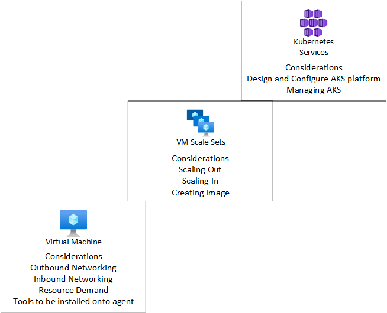
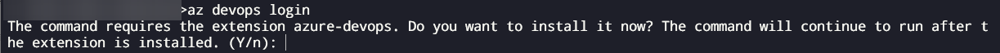

# Deploy Azure DevOps Self Hosted Agents

## Introduction
In this repo, I have provided scripts to automate the deployment and the configuration of the Azure DevOps agent software.

**What is a Azure DevOps Agent?**

In Azure DevOps you need a agent to execute your pipeline activities. 

For example, if you are using Terraform. A pipepline task will download your Terraform code from version control into the agent instance. The agent then will trigger the Terraform workflow and deploy your infrasture. These steps are defined in your pipeline, but executed on the agent.

**Choices**

When developing any complex solution, there are always choices to be made. With Azure DevOps agents, we need to decide if you want Microsoft to manage your agents or if you want to host and manage your own agents. 

I do not want to go into the merits of both options, as Microsoft already provide documentation on this (see useful information). This repo is useful if you have decided that the self-hosted agent option is the best solution for you. 

This repo provides scripts to deploy a Linux self-hosted agent. I am also working on a PowerShell script, which I will post soon. This will allow you to deploy either a Windows or Linux self-hosted agent.

In the next section, I will go through the steps to deploy a Linux Self-Hosted agent. I will also describe some design considerations to look out for...

# Linux Self-Hosted Agents

AKS or Azure Container Instances is a common platform to host your Azure DevOps agents. To go from using Microsoft hosted agent to AKS is possible. Here is some guidance on how to prepare a container [Microsoft Documentation: Microsoft Self-Hosted container](https://docs.microsoft.com/en-us/azure/devops/pipelines/agents/docker?view=azure-devops). 

In large enterprises, it is sometimes better to deploy a virtual machine, then move up the stack until we reach our target solution by using a containerised solution. As there are a number of platform consideration to tackle, such as networking, policy, RBAC. The high-level diagram shows we can break a large problem down into smaller steps. This requirement is normally discussed and agreed during the design phase, as the approach is tailored to meet the business requirements.



The remaining parts of this section, will walk through the steps to deploy and configure a Linux Self-Hosted agent via automation.

** Pre-req - Create Virtual Network and Network Security Group **

Sign into correct subscription using Azure CLI:

```
# This command isn't required if your using Cloud Shell
az login

# To ensure you have the correct subcription selected
az account show

## If you want to switch to another subscription, use following commands

## Show list of subscriptions, available to you
az account list --output list

## Switch subsscription
az account set --subscription "<subscriptionname>"

## az account show, should now show the deployment subscription
```

The below set of commands will create a virtual network and network security group. You can skip this step, if you want to use a existing virtual network.

```
# Set variables
resourcegroup="rg-azdo-selfhosted02"
location="northeurope"
vnetname="vnet-selfhosted02"
addressprefix="10.3.0.0/22"
subnetname="sn-azdoagents"
subnetprefix="10.3.0.0/24"
nsgname="nsg-azdoagents"
priority=500
nsgrulename="ssh_tmp_rule_01"
sourcepublicip="<yourpublicip>"

# Create resource group
az group create --location $location --name $resourcegroup

# Create Network Security Group
az network nsg create --resource-group $resourcegroup --name $nsgname --location $location

# Create NSG rule to allow SSH connections inbound for troubleshooting - This isn't required
az network nsg rule create --name $nsgrulename --nsg-name $nsgname --resource-group $resourcegroup --access Allow --source-address-prefixes $sourcepublicip --direction inbound --protocol tcp --destination-address-prefixes $subnetprefix --destination-port-ranges 22 --priority $priority

## Create virtual network
az network vnet create --name $vnetname --resource-group $resourcegroup --address-prefixes $addressprefix --location $location --subnet-name $subnetname --subnet-prefixes $subnetprefix --network-security-group $nsgname
```

We have now deployed our networking components for our lab environment. 

**Step 1 - Deploy a Virtual Machine**
There are a number of ways to complete this step using automation. Terraform, PowerShell, Azure CLI, Bicep. ARM Templates and the list goes on ...

For simplicity I have selected Azure CLI, which can be run as a pipeline task. Before, create the virtual machine, I have created a ssh key to secure the virtual machine:

[Windows: Microsoft Documentation: SSH public and private key](https://docs.microsoft.com/en-us/azure/virtual-machines/linux/ssh-from-windows)
[Mac: Microsoft Documentation: SSH public and private key](https://docs.microsoft.com/en-us/azure/virtual-machines/linux/mac-create-ssh-keys)


Now we can use Azure CLI to deploy both resource group and virtual machine. Note, in this lab environment, I have a network security group set at subnet level. Therefore, I haven't attached another network security group to the network interface of the virtual machine.


```
# Set variables
resourcegroup="rg-azdo-selfhosted02"
image="Canonical:0001-com-ubuntu-server-focal:20_04-lts:latest"
adminusername="azureuser"
sshkey="./.ssh/id_rsa.pub"
location="northeurope"
vmname="vm-agent03"
vmsize="Standard_B2s"
vnetname="vnet-selfhosted02"
subnetname="sn-azdoagents"

# Create resource group
az group create --location $location --name $resourcegroup

# Build virtual machine

# Note at the time of writting this script, 18.04-LTS was default image. I have gone for 20-04-lts**

az vm create --name $vmname --resource-group $resourcegroup --image $image --admin-username $adminusername --public-ip-sku "Standard" --nic-delete-option="Delete" --os-disk-delete-option="Delete" --nsg "" --size $vmsize --ssh-key-value $sshkey --vnet-name $vnetname --subnet $subnetname
```

Once, deployed you have a Ubuntu server deployed into your subscription. You can ssh into the server, by using below command. This ssh connection is optional, as we are going to install and configure all tools via automation.

To remotely connect to server, use ssh at the command line:


```
ssh -I id_rsa <adminusername>@<publicip>
```

**Step 2 - Create DevOps PAT Token**

You will need to create PAT token, to register agents to your DevOps organisation.

I created a PAT token called AgentToken in a lab environment, most organisations will have their own naming conventions.

The steps to create this PAT token are documented here [Azure DevOps PAT Token](https://docs.microsoft.com/en-us/azure/devops/organizations/accounts/use-personal-access-tokens-to-authenticate?view=azure-devops&tabs=Windows)

**Remember to securely store the PAT secret, in later steps we will record store this PAT secret in Azure Key Vault**

**Step 3 - Configure Azure DevOps Agent Pools**

This step can be completed via the portal or via Azure CLI. Microsoft have documented the steps you need to complete via the portal [Microsoft Documentation: Microsoft Create and Manage Agent Pools](https://docs.microsoft.com/en-us/azure/devops/pipelines/agents/pools-queues?view=azure-devops&tabs=yaml%2Cbrowser)

I tried to use Azure CLI to create the agent pool. As there is an excellent DevOps extension. I have listed the authentication steps for your information. However, once I authenticated I noticed there isn't a command to create a agent pool at this point in time [GitHub Issue](https://github.com/Azure/azure-devops-cli-extension/issues/808).

**Failed attempt to try to automate the Azure DevOps agent pool creation**

The first set of commands, will configure your default DevOps project:


```
# Remember to replace <> string with your DevOps organisation name
az devops configure --defaults orginization=https://dev.azure.com/<YourDevOpsOrganisation>/
```

The first time you run the Azure DevOps extension, you will see this message. Press 'Y' to install the extension, as it isn't installed by default when you install the Azure CLI core extensions.



To sign into DevOps run the below two commands:


```
az devops login
# Paste in the PAT secret from step 2
# Below command will show if you are connected to your DevOps organsisation correctly
az deveps projects list
```

I stopped here and used the portal method, in this article [Microsoft Documentation: Microsoft Create and Manage Agent Pools](https://docs.microsoft.com/en-us/azure/devops/pipelines/agents/pools-queues?view=azure-devops&tabs=yaml%2Cbrowser). As the Azure CLI command to create the agent was missing. Once, you have created the agent pool, please move onto step 4.

**Step 4 - Configure Key vault** 

I created a Key vault using the following Azure CLI commands. In my lab environment, I have placed all resources in the same resource group (rg-azdo-selfhosted). This allows me to quickly destory the resource group, once I have finished with the resource. In production, you may consider, seperating the resources into different resource groups.


```
# Set variables
resourcegroup="rg-azdo-selfhosted02"
keyvaultname="kvlabselfh02"
location="northeurope"
secretname="azdoAgentPAT"
assignee="<rbacgrouporusertocreatesecrets>"

# Create Vault
az keyvault create --name $keyvaultname --resource-group $resourcegroup --location $location --enable-rbac-authorization true
# Once, resource has completed, set output id to below keyvaultid
read -d '' keyvaultid <<< $(az keyvault show --name $keyvaultname --query 'id' -o tsv)

# Provide RBAC permission for your account to create a secret - Key Vault Secrets Officer
az role assignment create --role b86a8fe4-44ce-4948-aee5-eccb2c155cd7 --scope $keyvaultid --assignee $assignee

# PAT token was create during step 2
read -p "Enter Azure DevOps PAT secret:" -rs secret

# Create Secret
az keyvault secret set --vault-name $keyvaultname --name $secretname --value $secret 

# Create user identity, assign key vault secrets user - This allows the virtual machine is retrieve the secret
az vm identity assign --resource-group $resourcegroup --name $vmname --scope $keyvaultid --role 4633458b-17de-408a-b874-0445c86b69e6
```

**Step 5 - Install Azure Agent onto newly created Virtual Machine**

This is the final step, in this step we install and configure the agent. To do this run the deployAzDoAgent.sh bash script. Before, running the script set the variables to machine the resource we recently created.

To invoke the command. Run this command (Note, I have cloned this public repo onto my local drive c:\repos, your path may be different):

```
az vm run-command invoke --resource-group "rg-azdo-selfhosted02" --name "vm-agent03" --command-id RunShellScript --scripts @"C:\repos\deployAzDoAgent\deployAzDoAgent.sh"
```

**Optional Step 6 - Tidy Up**

This step should only be run if you no longer require the agent to registered to Azure DevOps

Unregister the agent from Azure Devops

```
az vm run-command invoke --resource-group "rg-azdo-selfhosted02" --name "vm-agent03" --command-id RunShellScript --scripts @"C:\repos\deployAzDoAgent\uninstallAzDoAgent.sh"
```


Delete resource group

```
az group delete --name "rg-azdo-selfhosted02"

```

# Conclusion

These steps show the automated tasks to deploy a Microsoft self-hosted agent as a Linux virtual machine. Currently working on documenting a pipeline to deploy the agent. Also, working on documentating the steps to deploy a Microsoft self-hosted agents.


# Useful Information

[Microsoft Documentation: Microsoft-Hosted Agents](https://docs.microsoft.com/en-us/azure/devops/pipelines/agents/hosted?view=azure-devops&tabs=yaml)

[Microsoft Documentation: Self-Hosted Linux Agents](https://docs.microsoft.com/en-us/azure/devops/pipelines/agents/v2-linux?view=azure-devops)

[Microsoft Documentation: Self-Hosted Windows Agents](https://docs.microsoft.com/en-us/azure/devops/pipelines/agents/v2-windows?view=azure-devops)

