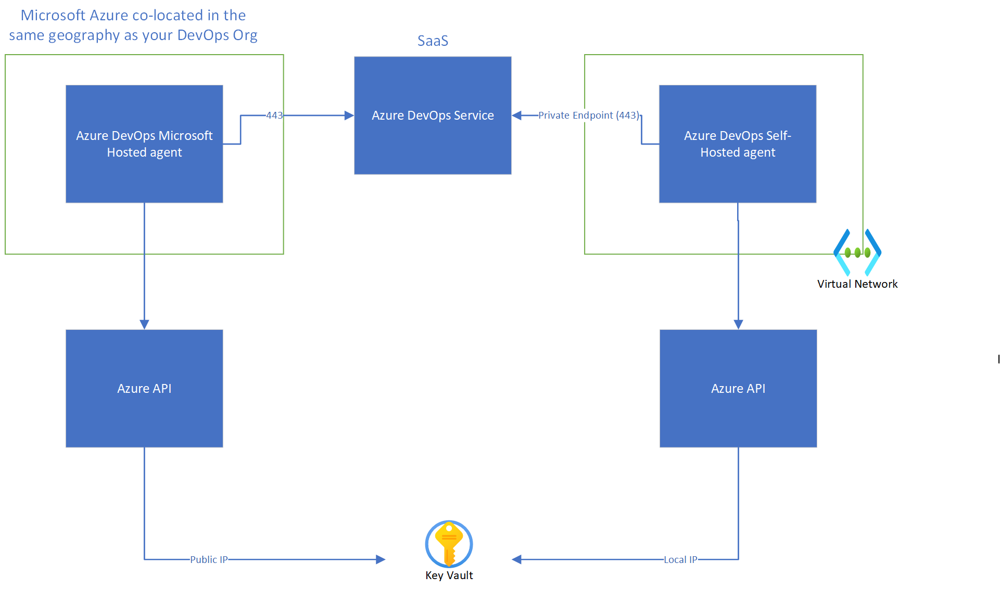
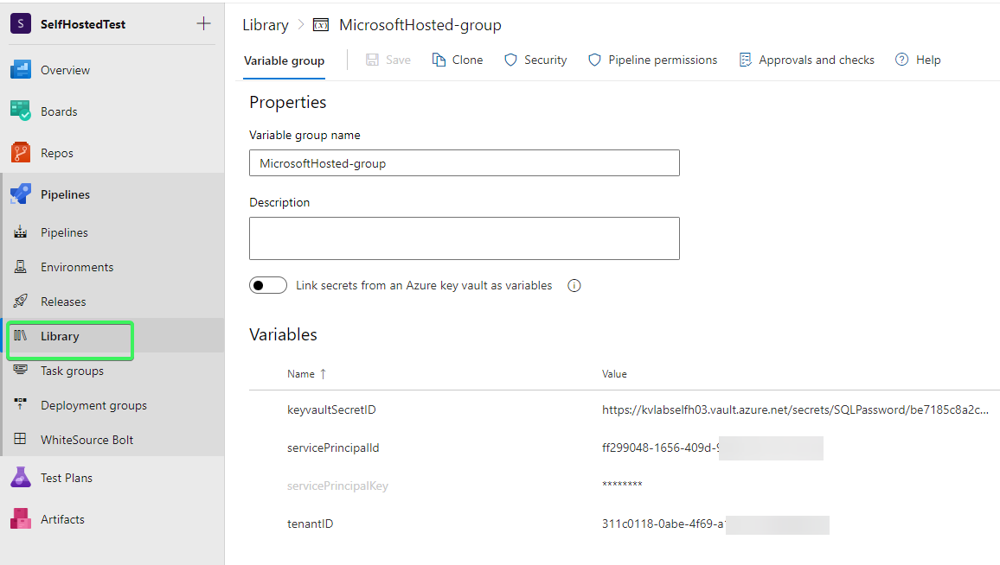
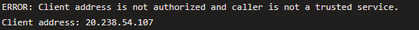

# Why use Azure DevOps Self-Hosted Agents?

# Introduction
Azure DevOps agent allow you to build and deploy infrastrasture. They are the compute resource which is provisioned to run your pipeline activities.

There are two choices, you can have self-hosted agent or Microsoft hosted.

In Microsoft's documentation the following guidance is provided:

> "There are several benefits to running your pipeline on Microsoft-hosted agents, from a security perspective. If you run untrusted code in your pipeline, such as contributions from forks, it is safer to run the pipeline on Microsoft-hosted agents than on self-hosted agents that reside in your corporate network." [Microsoft Hosted Agents](https://docs.microsoft.com/en-us/azure/devops/pipelines/agents/hosted?view=azure-devops&tabs=yaml#security)

In this article, we are going to look at reasons why people use self-hosted. As the above paragraph is a strong reason in favour of Microsoft-hosted agents. So why do so many people run their own self-hosted agents?

# Reason 1 - Networking

Azure DevOps is a PaaS service, the Microsoft self-hosted are co-located compute resource. They are not provisioned within one of your subscription. The below diagram illustrates the networking differences between the two types of agents.



The remaining part of this section will demonstrate Azure DevOps communicating with Key Vault and a Storage account.

*1, Key Vault*
The following Azure CLI was used to deploy the Key Vault

```
# Change variable values, to match your environment
servicepinciple="ff299048-1656-409d-9590-9971ef7701b3" 
resourcegroup="rg-azdo-selfhosted02"
keyvaultname="kvlabselfh03"
location="northeurope"
myaccount="<youruseridrunningtheclicommands>"

az keyvault create --name $keyvaultname --resource-group $resourcegroup --location $location --enable-rbac-authorization true
read -d '' keyvaultid <<< $(az keyvault show --name $keyvaultname --query 'id' -o tsv)

# Set user to set secrets, the account your currently signed in as
az role assignment create --role b86a8fe4-44ce-4948-aee5-eccb2c155cd7 --scope $keyvaultid --assignee $myaccount

az keyvault secret set --vault-name $keyvaultname --name 'SQLPassword' --value 'Pa$$w0rd'

az keyvault update --resource-group $resourcegroup --name $keyvaultname --bypass AzureServices
az keyvault update --resource-group $resourcegroup --name $keyvaultname --default-action Deny

# Allow service principle to read secret
az role assignment create --role 4633458b-17de-408a-b874-0445c86b69e6 --scope $keyvaultid --assignee $servicepinciple

```

I created this pipeline using a Microsoft hosted agent. YAML shown below:

```
# Pipeline to show network path - Microsoft hosted
# Start with a minimal pipeline that you can customize to build and deploy your code.
# Add steps that build, run tests, deploy, and more:
# https://aka.ms/yaml
# You will need to change the reference to your recently created key vault

trigger:
- main

pool:
  vmImage: ubuntu-latest

steps:
- script: |
    curl -s http://ipinfo.io/json | jq '.ip'
  displayName: 'Run a script to retrieve IP address'
- script: |
     az keyvault secret show --id $(keyvaultSecretID)
```

I created this variable group:



When you run this pipeline, you will see this error:



The Key vault firewall is denying access. This also a common problem with storage accounts, when working with Terraform. The state file is held in a storage account, but the Microsoft hosted agent can access the state file. 

There are two work arounds:

1, Identify IP ranges - The IP ranges are updated weekly, so the solution must be reviewed each week [Microsoft Documentation: IP Ranges](https://docs.microsoft.com/en-us/azure/devops/pipelines/agents/hosted?view=azure-devops&tabs=yaml#to-identify-the-possible-ip-ranges-for-microsoft-hosted-agents)

2, Disable firewall on Key vault / Storage account - This isn't best practice and is not recommended.

A self-hosted agent, can use private endpoints to ensure the data transits across your virtual networks.

```
# Variables
resourcegroup="rg-azdo-selfhosted02"
keyvaultname="kvlabselfh03"
location="northeurope"
subnetname="sn-azdoagents"
vnetname="vnet-selfhosted02"
dnszonelinkname="pl-$vnetname"
pekeyvaultname="pe-$keyvaultname"
privatednsname="privatelink.vaultcore.azure.net"

# Disable Virtual Network Policies
az network vnet subnet update --name $subnetname --resource-group $resourcegroup --vnet-name $vnetname --disable-private-endpoint-network-policies true

# Create a Private DNS Zone
az network private-dns zone create --resource-group $resourcegroup --name $privatednsname

# Link the Private DNS Zone to the Virtual Network
az network private-dns link vnet create --resource-group $resourcegroup --virtual-network $vnetname --zone-name privatednsname --name $dnszonelinkname --registration-enabled true

# Retrieve key vault resource id
keyvaultid=$(az keyvault show --resource $resourcegroup --name $keyvaultname --query 'id' --output tsv)

# Create private endpoint
az network private-endpoint create --resource-group $resourcegroup --vnet-name $vnetname --subnet $subnetname --name $pekeyvaultname  --private-connection-resource-id $keyvaultdid --group-id vault --connection-name $dnszonelinkname --location $location

# Register with Private DNS
az network private-endpoint dns-zone-group add --endpoint-name $pekeyvaultname --name default --private-dns-zone $privatednsname --resource-group $resourcegroup --zone-name "privatelink_vaultcore_azure_net"

```

I have another pipeline, which uses the self-hosted agent created using the instructions in the README. This pipeline looks like this:

```
# Pipeline to show network path - Self hosted hosted
# Start with a minimal pipeline that you can customize to build and deploy your code.
# Add steps that build, run tests, deploy, and more:
# https://aka.ms/yaml

pool:
  # Note, you will need to change below value to Default, to deploy initial agent
  # The first self hosted agent, will be deployed using a host agent
  name: 'LinuxSelfHosted'

stages:
- stage: Prereqs
  jobs:
    - job: InstallAptPackages
      continueOnError: false
      steps:
      - script: |
          sudo apt-get update
          sudo apt-get -y install jq
        displayName: 'Install apt packages'
    - job: InstallAzCLI
      continueOnError: false
      steps:
      - script: curl -sL https://aka.ms/InstallAzureCLIDeb | sudo bash
        displayName: 'Install AZ CLI'
- stage: GetInfo
  jobs:
     - job: GetIPInfo
       displayName: 'Run a script to retrieve IP address'
       continueOnError: false
       steps:
       - task: AzureCLI@2
         inputs:
           azureSubscription: 'scSelfHostedAgent'
           scriptType: 'bash'
           scriptLocation: 'inlineScript'
           inlineScript: 'curl -s http://ipinfo.io/json | jq ''.ip'''
     - job: KeyVaultShow
       displayName: 'Show Key vault data'
       continueOnError: false
       steps:
       - task: AzureCLI@2
         inputs:
           azureSubscription: 'scSelfHostedAgent'
           scriptType: 'bash'
           scriptLocation: 'inlineScript' 
           inlineScript: |
               az keyvault secret show --id "https://<yourkeyvaulturl>/secrets/SQLPassword/be7185c8a2c547b0b2961db3c512e3bd"

```

The pipeline now will run without error. We have used a key vault private endpoint and a self-hosted agent directly connected to the virtual network. The data now transits only via the virtual network. Which overcomes the firewall problem, we found when using the Microsoft hosted agents.

**This network connectivity consideration applies to many PaaS services. Commonly, a DevOps agent will need to connect to a storage account, to access a Terraform state file.**


# Reason 2 - Installed agent software 

A Microsoft hosted agent can run on various versions of Windows, Ubuntu or MacOS. The same images are used by both Azure DevOps and for GitHub runners. This [link](https://github.com/actions/runner-images/tree/main/images) provides a full list of packages which are installed into the images. These images are frequently updated. 

This is a big benefit of Microsoft hosted agent, there is no need to update your agents, as its all managed by Microsoft.

However, you will need to use a pipeline if you need to:
1, Update to the very latest version of a tool
2, Need to install a tool not contained within the image

**After, execution of your pipeline, the agent resource is destoryed. Therefore, you will need to add the update / install task during each pipeline execution. Which would increase the pipeline execution time. You are in control of the images used to build self-hosted agents, therefore you can tailor each agent to meet your business requirements.**

# Reason 3 - Compute resources

Microsoft hosted agents are allocated the following resources:

| Hardware   	| Capacity        	        |
|------------	|---------------------------|
| VM Size    	| General Purpose (DS2_v2)	|
| Memory     	| 7GB             	        |
| Disk Space 	| 10GB available           	|
| Disk Type  	| SSD             	        |
| CPU        	| 2 Cores         	        |


1, Disk Space
One of first tasks of the pipeline is to execute a git fetch. Which will download files from your remote repository onto the hosted agent (by default the path is C:\agent\_work\1\<reponame>). 

If your Git repository is larger than 10GB, then you may need to consider using a [shallow fetch](https://docs.microsoft.com/en-us/azure/devops/pipelines/repos/pipeline-options-for-git?view=azure-devops&tabs=yaml#shallow-fetch)

2, Memory and CPU limits
You may hit capacity issues, if your pipeline is processor or memory intensive, for example encoding video or modelling data.


**Your pipeline may consume the compute resources, if one or more above considerations apply to your workload?**

GitHub runners have recently announced in beta [GitHub Runners](https://github.blog/2022-09-01-github-actions-introducing-the-new-larger-github-hosted-runners-beta/). The Microsoft Azure DevOps product team have not made a similar announcement.  

# Reason 3 - Pipeline execution time

As stated in reason 2, you may need to include build tasks to install software, which is required by your pipeline. This will increase the overall pipeline execution time.

Reason 3 also mentions the agents are provisioned using smaller general purpose virtual machines. This can also have an impact on pipeline execution time.

**Self-hosted agents will provide more control, as you can decide the agent resource size. You can also tailor the agent image. However, with this increase in control, also brings with it an increased workload to maintain your agents.**


# Reason 5 - Sovereign regions

You select a region, when you create a DevOps organisation. Currently, you have these regions to select from:

- Australia
- Brazil
- Canada
- Asia Pacific
- Europe
- India
- United Kingdom
- United States

Windows and Linux Microsoft-hosted agents will provisioned in the same geography as your Azure DevOps organisation. 

**MacOS hosted agents are provisioned in Github's macos cloud, which is located in the United States**. This is a consideration, when running MacOS hosted agents.

# Reason 6 - Timeout

Some deployments take time to execute, for instance older SKU's of VPN gateways can take up to 45 minutes to deploy. By, default a pipeline job will time out if the job takes over 60 minutes. The below time out parameter will overide this default value:

```
jobs:
- job: myJob
  timeoutInMinutes: 80
  pool:
    vmImage: 'ubuntu-latest'
  steps:
  - bash: echo "Hello world"
```

However, a Microsoft-hosted agent has a maximum limit of 60 minutes for private projects and 360 minutes for public projects [Timeout limits](https://docs.microsoft.com/en-us/azure/devops/pipelines/process/phases?view=azure-devops&tabs=yaml#timeouts)

**This can be a consideration if your pipeline task are long running**

# FAQ
**What permissions are required to register an agent pool?**
At Azure DevOps Organisation level you need to have the Administrator role [Security of agent pools](https://docs.microsoft.com/en-us/azure/devops/pipelines/agents/pools-queues?view=azure-devops&tabs=yaml%2Cbrowser#security)

**How does each self-agent hosted agent communicate with Azure DevOps?**
Self-hosted agents will poll for pipeline jobs which orginate from Azure DevOps. The below article details the outbound IP address ranges.

[Outbound Connections](https://docs.microsoft.com/en-us/azure/devops/organizations/security/allow-list-ip-url?view=azure-devops&tabs=IP-V4#outbound-connections)

# Summary

Microsoft documentation recommends using Microsoft hosted agents where possible. This article provides 5 popular reasons, to support the use of self-hosted agents.